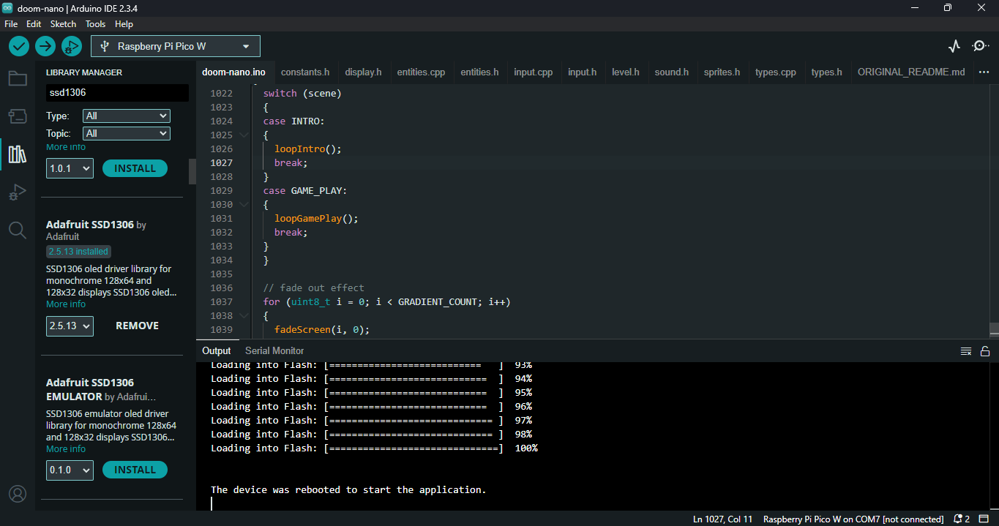
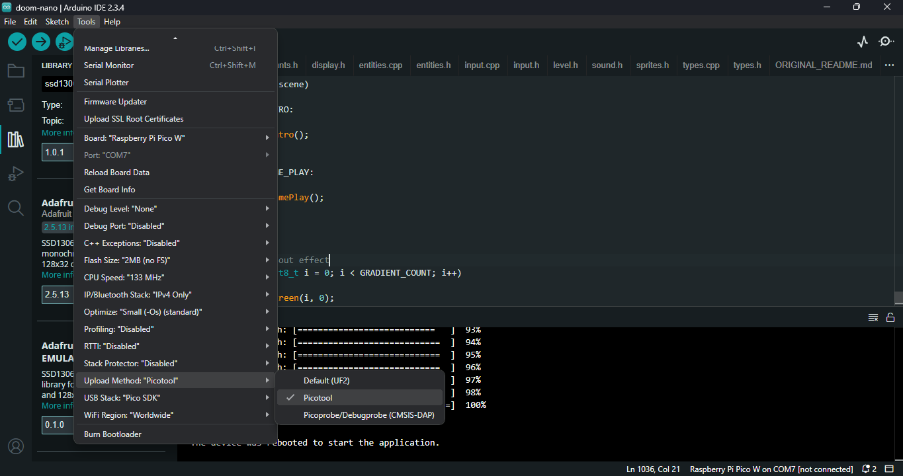

# doom-nano
This is a fork of a minimal Doom version for Arduino Nano, changed for work with BitDogLab. The original readme.md ([README.md](./_README.md)) is avaible and the [original repository](https://github.com/daveruiz/doom-nano) also if you are interested to see commits to see how changed from code attached to avr architecture and changed to generic architecture approach using arduino.


Youtube video of gameplay in BitDogLab board:  
https://youtube.com/shorts/MBNVieKgH24

# Como instalar
* Você precisa ter instalada a última versão do [**Arduino IDE**](https://www.arduino.cc/en/software).
* **Siga este [tutorial](https://randomnerdtutorials.com/programming-raspberry-pi-pico-w-arduino-ide/)** para fazer o Arduino IDE rodar o jogo no Pi Pico e como configurá-lo.
* **Baixe este repositório**. Você pode usar o comando git clone assim:
```bash
git clone https://github.com/diassisfilho/doom-nano.git
```
* Se você quiser outro método além de usar git clone, clique no botão verde 'Code' neste repositório e clique em 'Download Zip', baixe e descompacte.
* Clique no código doom-nano.ino para abrir com o **Arduino IDE** e então selecione a placa Raspberry Pi Pico W.
* Instale a biblioteca dependente Adafruit SSD1306 na aba de bibliotecas do Arduino IDE:

* Selecione o método de upload picotool:

* Então clique no Arduino IDE para fazer o upload do código (seta verde à direita)
* Aproveite seu jogo ;)

# How to install
* You need installed the last version of [**Arduino IDE**](https://www.arduino.cc/en/software). 
* **Follow this [tutorial](https://randomnerdtutorials.com/programming-raspberry-pi-pico-w-arduino-ide/)** to make Arduino IDE run the game in Pi Pico and how to configure it.
* **Download this repository**. You can use git clone command like this:
```bash
git clone https://github.com/diassisfilho/doom-nano.git
```
* If you want another method than use git clone just click in 'Code' green button in this repositorie and click in 'Download Zip', download and unzip.
* Click in doom-nano.ino code to open with **Arduino IDE** and then select Raspberry Pi Pico W board.
* Install the dependent Adafruit SSD1306 librarie in Arduino IDE libraries tab:

* Select picotool upload method:

* Then click in Arduino IDE to upload code (green right arrow)
* Enjoy your gameplay ;)

# License
This project is licensed under the MIT License. See the [LICENSE](./LICENSE) file for details.
